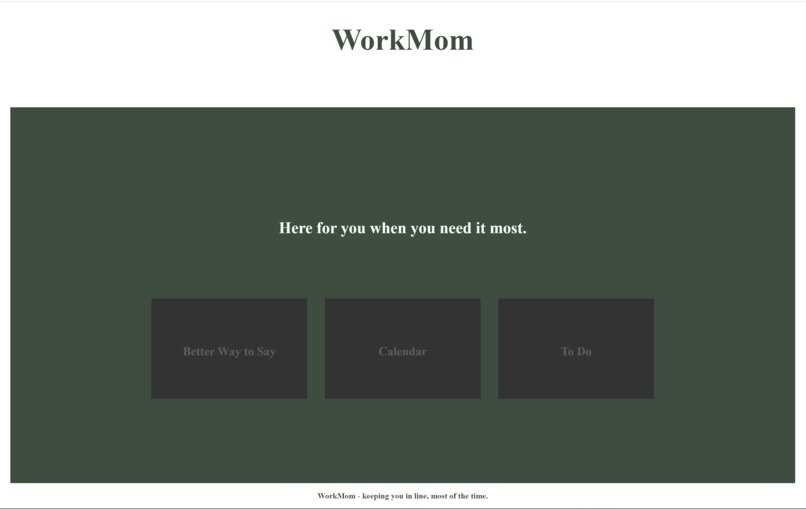

# WorkMom
A task management and organization app, WorkMom using HTML, CSS, JavaScript, and Python. Done at SHEHACKS hackathon. 

By: 
Lara El-Aloul
Aya Maree
Sarah Haniya

DEVPOST:
https://devpost.com/software/workmom
